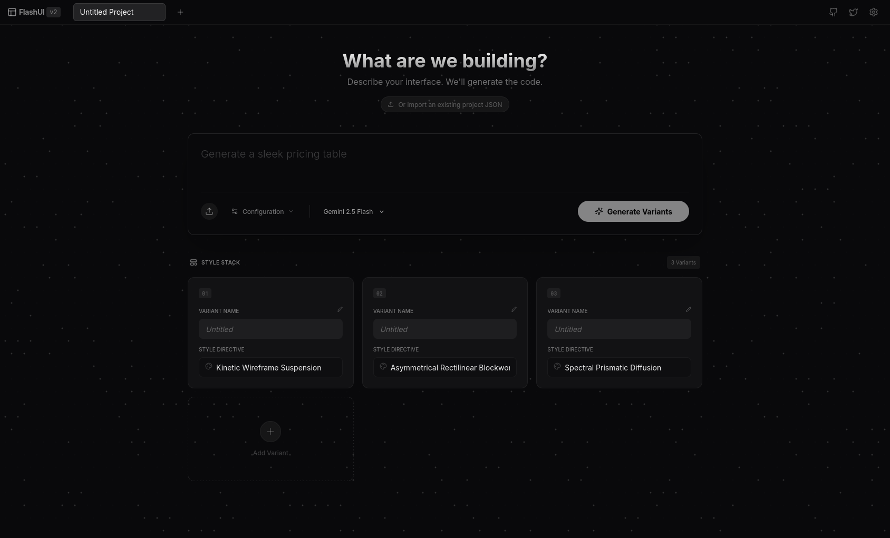

<div align="center">

# ⚡ Flash UI V2

**Put Gemini's creativity and coding abilities to the test.**
Rapidly generate stunning UI designs, explore radical style variations, and export production-ready code.



[](LICENSE)
[](https://react.dev)
[](https://ai.google.dev)

</div>

---

## What is Flash UI V2?

Flash UI V2 is an AI-powered UI generation tool that transforms text prompts into fully coded, visually stunning web interfaces. Describe what you want, pick a creative style direction, and get multiple high-fidelity design variants — each with its own unique aesthetic — generated in seconds.

This project is an enhanced evolution of the original **Flash UI** by **[@ammaar](https://x.com/ammaar)** from **[Google AI Studio](https://ai.studio)**.

### Key Features

- **Multi-Variant Generation** — Generate 3-5 design variants simultaneously, each with a distinct creative direction
- **50+ Style Metaphors** — Rich physical/material metaphor styles like "Grainy Risograph Layering", "Molten Chrome Reflection", "Bioluminescent Deep Ocean", and more
- **Live Code Editor** — Built-in Monaco editor for real-time HTML/CSS/JS editing
- **AI-Powered Modifications** — Iterate on designs with natural language instructions
- **Visual Annotations** — Draw directly on previews to guide AI modifications
- **Project Management** — Multiple projects with tabbed navigation
- **Version History** — Undo/redo with named checkpoints per variant
- **Export Options** — Download as ZIP, export project as JSON, or copy code
- **Image References** — Upload screenshots to guide generation
- **Full Build Mode** — Expand designs into production-ready, responsive pages

### Design Philosophy

Flash UI V2 uses a **metaphor-driven design system** inspired by the original Flash UI. Instead of generic style labels, each variant is guided by physical/material metaphors (e.g. "Spectral Prismatic Diffusion", "Eroded Concrete Brutalism") that push the AI to commit fully to a distinct aesthetic — producing designs with intentional typography, textures, animations, and compositions rather than generic Bootstrap-style layouts.

---

## Getting Started

### Prerequisites

- [Node.js](https://nodejs.org/) (v18+)
- [pnpm](https://pnpm.io/) (recommended) or npm
- A [Gemini API Key](https://aistudio.google.com/apikey)

### Installation

```bash
# Clone the repository
git clone https://github.com/AlexsdeG/Flash-UI-V2.git
cd Flash-UI-V2

# Install dependencies
pnpm install

# Set your Gemini API key
# Edit .env.local and add your key, or configure it in the app's settings
```

### Running Locally

```bash
pnpm dev
```

The app will be available at `http://localhost:5173`.

### Building for Production

```bash
pnpm build
pnpm preview
```

---

## Tech Stack

| Technology | Purpose |
|---|---|
| [React 19](https://react.dev) | UI Framework |
| [TypeScript](https://typescriptlang.org) | Type Safety |
| [Vite](https://vitejs.dev) | Build Tool |
| [Zustand](https://zustand-demo.pmnd.rs/) + [Immer](https://immerjs.github.io/immer/) | State Management |
| [Monaco Editor](https://microsoft.github.io/monaco-editor/) | Code Editor |
| [Google Gemini API](https://ai.google.dev) | AI Generation |
| [Tailwind Merge](https://github.com/dcastil/tailwind-merge) | Styling Utilities |
| [Lucide React](https://lucide.dev) | Icons |
| [Sonner](https://sonner.emilkowal.dev) | Toast Notifications |
| [JSZip](https://stuk.github.io/jszip/) | ZIP Export |
| [html2canvas](https://html2canvas.hertzen.com/) | Thumbnails |

---

## Credits

This project is built on top of the original **Flash UI** created by **[@ammaar](https://x.com/ammaar)** (Ammaar Aslam) at **[Google AI Studio](https://ai.studio)**.

- **Original Flash UI** — [View on AI Studio](https://ai.studio/apps/d2b4dbb1-c478-431a-914a-d4930b88c571)
- **Original Author** — [@ammaar](https://x.com/ammaar)

V2 extends the original with project management, a full code editor, version history, enhanced AI prompts with metaphor-driven design, and an expanded creative style system.

---

## License

This project is licensed under the [GNU General Public License v3.0](LICENSE).
